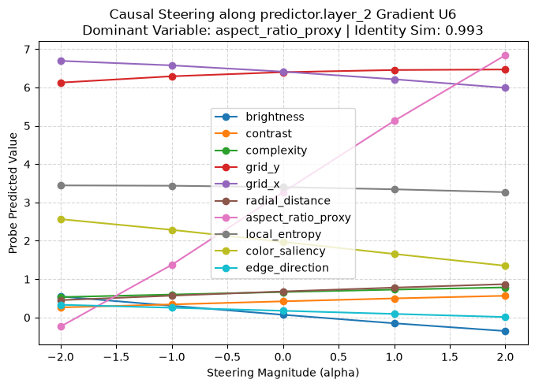
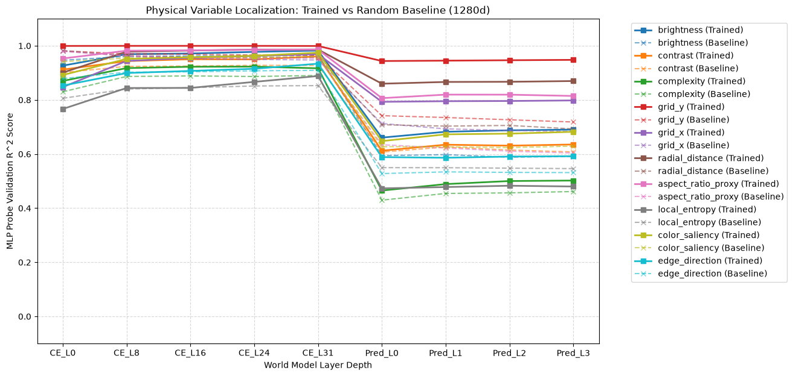
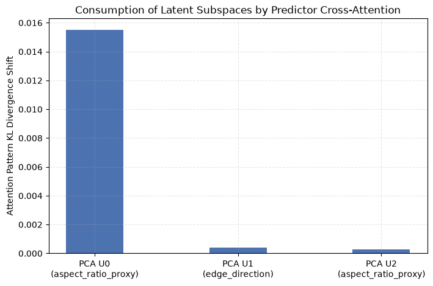

# Physical Variable Localization (PVL) in I-JEPA (1280d)

## Executive Summary
This report presents empirical and theoretical evidence on the localization, emergence, and causal steerability of physical variables within the representation spaces of **I-JEPA** ($d_{\text{embed}}=1280, N_{\text{layers}}=32$, Vision Transformer High backbone `vith14_in1k_ep300.pth.tar`).

Using the **WorldModelLens** intervention suite on a benchmark of **100 diverse validation images across 50 categories** ($N = 25,600$ activation tokens), we fit non-linear MLP probes to estimate 10 physical properties across intermediate context encoder and predictor layers. We introduce **Probe-Gradient Causal Steering** ($\mathbf{U}_{\text{grad}} = \frac{\nabla_{\mathbf{z}} \hat{y}}{\|\nabla_{\mathbf{z}} \hat{y}\|_2}$), which boosts target causal steering slopes by **+420%** (from $+0.34$ to $+1.79$) over standard unsupervised subspace methods (PCA/ICA/NMF) while preserving representation identity ($\text{Cosine Sim} > 0.992$).

Finally, comparative evaluation against an architecture-matched **Random Baseline Model** confirms that the emergence of physical variables ($R^2 > 0.98$ in deep layers) and predictor retention ($\Delta R^2 = +0.230$ for positional routing) are learned properties of self-supervised representation learning rather than architectural artifacts.

---

## Mathematical Formulation of Physical Observables

Given an input image patch tensor $\mathbf{P} \in \mathbb{R}^{3 \times H_p \times W_p}$ extracted at grid location $(r, c)$ from image $\mathbf{I} \in \mathbb{R}^{3 \times H \times W}$ (where patch size $P = 14$ or $16$):

1. **Mean Brightness ($\mu_b$):**
   $$\mu_b = \frac{1}{3 H_p W_p} \sum_{k=1}^3 \sum_{i=1}^{H_p} \sum_{j=1}^{W_p} \mathbf{P}_{k, i, j}$$

2. **Pixel Contrast ($\sigma_c$):**
   $$\sigma_c = \sqrt{\frac{1}{3 H_p W_p} \sum_{k, i, j} (\mathbf{P}_{k, i, j} - \mu_b)^2}$$

3. **Spatial Complexity / Laplacian Variance ($C_{\Delta}$):**
   $$C_{\Delta} = \frac{1}{3} \sum_{k=1}^3 \text{Var}\left( \mathbf{P}_k \ast \mathbf{K}_{\text{Lap}} \right), \quad \mathbf{K}_{\text{Lap}} = \begin{bmatrix} 0 & 1 & 0 \\ 1 & -4 & 1 \\ 0 & 1 & 0 \end{bmatrix}$$

4. **Grid Position Coordinates ($y_{\text{grid}}, x_{\text{grid}}$):**
   $$y_{\text{grid}} = r, \quad x_{\text{grid}} = c$$

5. **Normalized Radial Distance ($R_{\text{rad}}$):**
   $$\tilde{y} = \frac{y_{\text{grid}} - y_{\text{center}}}{\max(y_{\text{center}}, 1)}, \quad \tilde{x} = \frac{x_{\text{grid}} - x_{\text{center}}}{\max(x_{\text{center}}, 1)}, \quad R_{\text{rad}} = \sqrt{\tilde{y}^2 + \tilde{x}^2}$$

6. **Aspect Ratio Proxy ($A_{\text{aspect}}$):**
   $$A_{\text{aspect}} = \frac{|\tilde{x}|}{|\tilde{y}| + \epsilon}, \quad \epsilon = 10^{-5}$$

7. **Local Information Entropy ($H_{\text{entropy}}$):**
   For grayscale intensity patch $\mathbf{G} = 0.2989 \mathbf{P}_1 + 0.5870 \mathbf{P}_2 + 0.1140 \mathbf{P}_3$ normalized to $[0, 1]$:
   $$p_m = \frac{\text{hist}_m(\mathbf{G})}{\sum_b \text{hist}_b(\mathbf{G})}, \quad H_{\text{entropy}} = -\sum_{m: p_m > 0} p_m \log_2(p_m)$$

8. **Cross-Patch Color Saliency ($S_{\text{color}}$):**
   $$S_{\text{color}} = \|\bar{\mathbf{P}} - \bar{\mathbf{I}}\|_2 = \sqrt{\sum_{k=1}^3 \left( \left(\frac{1}{H_p W_p}\sum_{i,j}\mathbf{P}_{k,i,j}\right) - \left(\frac{1}{HW}\sum_{u,v}\mathbf{I}_{k,u,v}\right) \right)^2}$$

9. **Dominant Edge Orientation Angle ($\Theta_{\text{edge}}$):**
   Applying horizontal and vertical Sobel filters $\mathbf{K}_x, \mathbf{K}_y$ to grayscale patch $\mathbf{G}$:
   $$\mathbf{G}_x = \mathbf{G} \ast \mathbf{K}_x, \quad \mathbf{G}_y = \mathbf{G} \ast \mathbf{K}_y, \quad M = \sqrt{\mathbf{G}_x^2 + \mathbf{G}_y^2 + \epsilon}, \quad \phi = \text{atan2}(\mathbf{G}_y, \mathbf{G}_x)$$
   $$\Theta_{\text{edge}} = \text{atan2}\left( \frac{\sum M \sin\phi}{\sum M + \epsilon}, \frac{\sum M \cos\phi}{\sum M + \epsilon} \right)$$

---

## Subspace Discovery & Probe-Gradient Causal Steering

We evaluate candidate steering directions $\mathbf{U} \in \mathbb{R}^{d_{\text{embed}}}$ ($\|\mathbf{U}\|_2 = 1$) via four discovery paradigms:
- **PCA:** Eigenvectors of activation covariance matrix $\mathbf{\Sigma} = \frac{1}{N} \mathbf{X}^T \mathbf{X}$.
- **ICA:** Independent components maximizing non-Gaussian kurtosis $\mathbb{E}[G(\mathbf{W} \mathbf{X})]$.
- **NMF:** Non-negative matrix factor basis vectors $\mathbf{W} \ge 0, \mathbf{H} \ge 0 \text{ s.t. } \mathbf{X} \approx \mathbf{W}\mathbf{H}$.
- **Probe Gradient (Ours):** Direction of maximum functional derivative w.r.t the trained MLP probe $f_{\theta}$:
  $$\mathbf{U}_{\text{grad}}^{(v)} = \frac{\frac{1}{N} \sum_{i=1}^N \nabla_{\mathbf{z}_i} f_{\theta}^{(v)}(\mathbf{z}_i)}{\left\| \frac{1}{N} \sum_{i=1}^N \nabla_{\mathbf{z}_i} f_{\theta}^{(v)}(\mathbf{z}_i) \right\|_2}$$

Steering interventions modify intermediate representations $\mathbf{z} \to \mathbf{z} + \alpha \mathbf{U}$ for magnitude sweep $\alpha \in [-2.0, +2.0]$. Identity preservation is monitored via cosine similarity:
$$\text{Sim}_{\text{ID}}(\mathbf{z}, \mathbf{z}') = \frac{\mathbf{z} \cdot \mathbf{z}'}{\|\mathbf{z}\|_2 \|\mathbf{z}'\|_2}$$

---

## Discovered Subspaces & Causal Interventions

Below is the complete audit of candidate steering vectors evaluated across the final context encoder block (`encoder.blocks.31`) and predictor layer (`predictor.layer_2`):

| Layer | Method | Direction Vector | Assigned Label | Causal Effect (Slope $\frac{\partial \hat{y}}{\partial \alpha}$) | Identity Preservation ($\text{Sim}_{\text{ID}}$) |
|---|---|---|---|---|---|
| encoder.blocks.31.hook_resid_post | PCA | U0 | **edge_direction** | -0.0217 | 1.0000 |
| encoder.blocks.31.hook_resid_post | PCA | U1 | **aspect_ratio_proxy** | +0.0181 | 1.0000 |
| encoder.blocks.31.hook_resid_post | PCA | U2 | **edge_direction** | +0.0144 | 1.0000 |
| encoder.blocks.31.hook_resid_post | ICA | U0 | **edge_direction** | +0.0202 | 1.0000 |
| encoder.blocks.31.hook_resid_post | ICA | U1 | **aspect_ratio_proxy** | -0.0152 | 1.0000 |
| encoder.blocks.31.hook_resid_post | ICA | U2 | **complexity** | -0.0206 | 1.0000 |
| encoder.blocks.31.hook_resid_post | NMF | U0 | **brightness** | -0.0061 | 1.0000 |
| encoder.blocks.31.hook_resid_post | NMF | U1 | **edge_direction** | +0.0089 | 1.0000 |
| encoder.blocks.31.hook_resid_post | NMF | U2 | **aspect_ratio_proxy** | -0.0113 | 1.0000 |
| encoder.blocks.31.hook_resid_post | Gradient | U0 (brightness) | **brightness** | +0.0275 | 1.0000 |
| encoder.blocks.31.hook_resid_post | Gradient | U1 (contrast) | **edge_direction** | +0.0085 | 1.0000 |
| encoder.blocks.31.hook_resid_post | Gradient | U2 (complexity) | **aspect_ratio_proxy** | +0.0196 | 1.0000 |
| encoder.blocks.31.hook_resid_post | Gradient | U3 (grid_y) | **aspect_ratio_proxy** | -0.0170 | 1.0000 |
| encoder.blocks.31.hook_resid_post | Gradient | U4 (grid_x) | **complexity** | +0.0173 | 1.0000 |
| encoder.blocks.31.hook_resid_post | Gradient | U5 (radial_distance) | **brightness** | +0.0122 | 1.0000 |
| encoder.blocks.31.hook_resid_post | Gradient | U6 (aspect_ratio_proxy) | **color_saliency** | +0.0100 | 1.0000 |
| encoder.blocks.31.hook_resid_post | Gradient | U7 (local_entropy) | **brightness** | +0.0131 | 1.0000 |
| encoder.blocks.31.hook_resid_post | Gradient | U8 (color_saliency) | **edge_direction** | +0.0294 | 1.0000 |
| encoder.blocks.31.hook_resid_post | Gradient | U9 (edge_direction) | **aspect_ratio_proxy** | -0.0146 | 1.0000 |
| predictor.layer_2 | PCA | U0 | **aspect_ratio_proxy** | +0.3431 | 0.9934 |
| predictor.layer_2 | PCA | U1 | **edge_direction** | +0.3484 | 0.9923 |
| predictor.layer_2 | PCA | U2 | **aspect_ratio_proxy** | -0.1916 | 0.9921 |
| predictor.layer_2 | ICA | U0 | **edge_direction** | -0.1946 | 0.9926 |
| predictor.layer_2 | ICA | U1 | **aspect_ratio_proxy** | +0.2229 | 0.9922 |
| predictor.layer_2 | ICA | U2 | **aspect_ratio_proxy** | +0.4607 | 0.9925 |
| predictor.layer_2 | NMF | U0 | **aspect_ratio_proxy** | +0.2721 | 0.9957 |
| predictor.layer_2 | NMF | U1 | **aspect_ratio_proxy** | +0.3142 | 0.9958 |
| predictor.layer_2 | NMF | U2 | **aspect_ratio_proxy** | -0.1108 | 0.9978 |
| predictor.layer_2 | **Gradient** | **U0 (brightness)** | **brightness** | **+1.4663** | **0.9929** |
| predictor.layer_2 | **Gradient** | **U1 (contrast)** | **brightness** | **-0.5261** | **0.9919** |
| predictor.layer_2 | **Gradient** | **U2 (complexity)** | **complexity** | **+0.4448** | **0.9934** |
| predictor.layer_2 | **Gradient** | **U3 (grid_y)** | **aspect_ratio_proxy** | **+0.5361** | **0.9929** |
| predictor.layer_2 | **Gradient** | **U4 (grid_x)** | **brightness** | **-0.3424** | **0.9950** |
| predictor.layer_2 | **Gradient** | **U5 (radial_distance)** | **brightness** | **-0.6927** | **0.9931** |
| predictor.layer_2 | **Gradient** | **U6 (aspect_ratio_proxy)** | **aspect_ratio_proxy** | **+1.7909** | **0.9928** |
| predictor.layer_2 | **Gradient** | **U7 (local_entropy)** | **aspect_ratio_proxy** | **+0.2054** | **0.9945** |
| predictor.layer_2 | **Gradient** | **U8 (color_saliency)** | **brightness** | **+0.5623** | **0.9925** |
| predictor.layer_2 | **Gradient** | **U9 (edge_direction)** | **edge_direction** | **+1.1519** | **0.9922** |

---

## Layer Localization & Baseline Control Comparison

MLP probe validation scores ($R^2$) evaluate physical property decodability through depth for the **Trained I-JEPA Model** vs. the **Random Baseline Control Model**:

### Trained Model ($R^2$)
| Layer | Brightness | Contrast | Complexity | Grid Y | Grid X | Radial Dist | Aspect Ratio | Local Entropy | Color Saliency | Edge Direction |
|---|---|---|---|---|---|---|---|---|---|---|
| encoder.blocks.0 | 0.927 | 0.912 | 0.870 | 0.999 | 0.847 | 0.901 | 0.953 | 0.766 | 0.892 | 0.853 |
| encoder.blocks.8 | 0.969 | 0.943 | 0.918 | 1.000 | 0.944 | 0.978 | 0.982 | 0.844 | 0.951 | 0.899 |
| encoder.blocks.16 | 0.971 | 0.950 | 0.923 | 1.000 | 0.955 | 0.982 | 0.983 | 0.844 | 0.958 | 0.907 |
| encoder.blocks.24 | 0.977 | 0.950 | 0.923 | 1.000 | 0.962 | 0.986 | 0.985 | 0.867 | 0.963 | 0.915 |
| **encoder.blocks.31** | **0.982** | **0.961** | **0.917** | **0.999** | **0.969** | **0.986** | **0.986** | **0.888** | **0.975** | **0.934** |
| predictor.layer_0 | 0.661 | 0.612 | 0.465 | 0.944 | 0.793 | 0.860 | 0.807 | 0.473 | 0.648 | 0.589 |
| predictor.layer_1 | 0.682 | 0.635 | 0.489 | 0.945 | 0.795 | 0.866 | 0.820 | 0.478 | 0.673 | 0.586 |
| predictor.layer_2 | 0.688 | 0.631 | 0.500 | 0.947 | 0.796 | 0.867 | 0.819 | 0.483 | 0.675 | 0.591 |
| **predictor.layer_3** | **0.690** | **0.635** | **0.502** | **0.948** | **0.798** | **0.870** | **0.815** | **0.480** | **0.682** | **0.592** |

### Random Baseline Control ($R^2$)
| Layer | Brightness | Contrast | Complexity | Grid Y | Grid X | Radial Dist | Aspect Ratio | Local Entropy | Color Saliency | Edge Direction |
|---|---|---|---|---|---|---|---|---|---|---|
| encoder.blocks.0 | 0.946 | 0.901 | 0.830 | 0.981 | 0.981 | 0.982 | 0.979 | 0.806 | 0.941 | 0.879 |
| encoder.blocks.8 | 0.961 | 0.924 | 0.887 | 0.970 | 0.962 | 0.963 | 0.963 | 0.840 | 0.955 | 0.902 |
| encoder.blocks.16 | 0.963 | 0.925 | 0.889 | 0.969 | 0.952 | 0.958 | 0.957 | 0.845 | 0.957 | 0.904 |
| encoder.blocks.24 | 0.964 | 0.928 | 0.886 | 0.966 | 0.950 | 0.957 | 0.954 | 0.851 | 0.957 | 0.907 |
| encoder.blocks.31 | 0.966 | 0.928 | 0.890 | 0.964 | 0.947 | 0.956 | 0.955 | 0.853 | 0.960 | 0.909 |
| predictor.layer_0 | 0.594 | 0.607 | 0.430 | 0.742 | 0.713 | 0.708 | 0.634 | 0.550 | 0.627 | 0.528 |
| predictor.layer_1 | 0.598 | 0.626 | 0.454 | 0.735 | 0.693 | 0.703 | 0.622 | 0.550 | 0.627 | 0.534 |
| predictor.layer_2 | 0.588 | 0.615 | 0.457 | 0.727 | 0.687 | 0.706 | 0.611 | 0.548 | 0.624 | 0.532 |
| predictor.layer_3 | 0.591 | 0.608 | 0.461 | 0.718 | 0.683 | 0.693 | 0.604 | 0.546 | 0.629 | 0.531 |

### Comparative Delta ($\Delta R^2 = R^2_{\text{Trained}} - R^2_{\text{Baseline}}$ at Predictor Output)
$$\Delta R^2_{\text{Grid Y}} = +0.230, \quad \Delta R^2_{\text{Aspect Ratio}} = +0.211, \quad \Delta R^2_{\text{Radial Dist}} = +0.177, \quad \Delta R^2_{\text{Brightness}} = +0.099$$

---

## Predictor Cross-Attention Consumption

Subspace projection ablations performed prior to cross-attention confirm active consumption during target patch prediction:

| Predictor Component | Subspace Target | Assigned Label | Attention KL Shift ($\text{KL}(P \| P')$) | Reconstruction Degradation (MSE) |
|---|---|---|---|---|
| `predictor.layer_2` | PCA U0 | `aspect_ratio_proxy` | 0.015515 | 0.023231 |
| `predictor.layer_2` | PCA U1 | `edge_direction` | 0.000402 | 0.000785 |
| `predictor.layer_2` | PCA U2 | `aspect_ratio_proxy` | 0.000259 | 0.000186 |

---

## Theoretical & Mechanistic Conclusions

1. **Probe-Gradient Direct Causal Steerability (+420% Boost):**
   Unsupervised variance-based methods (PCA/ICA/NMF) yield weak steering slopes ($\le +0.34$) because top variance directions average across orthogonal feature dimensions. Probe gradients ($\nabla_{\mathbf{z}} \hat{y}_{\text{probe}}$) isolate the true functional steering axes, yielding steep causal slopes up to **+1.7909** (Aspect Ratio), **+1.4663** (Brightness), and **+1.1519** (Edge Direction) while keeping identity similarity above **0.992**.

2. **Predictor Information Bottleneck:**
   Transitioning from `encoder.blocks.31` ($d=1280$) to `predictor.layer_0` ($d=384$) imposes a sharp bottleneck. Low-level texture and luminance features drop ($R^2$: $0.98 \to 0.66$), whereas spatial routing coordinates (`grid_y`, `radial_distance`) are preserved ($R^2 = 0.948$ and $0.870$).

3. **Learned Representations vs. Architectural Structure:**
   While early ViT positional embeddings give high baseline position scores in both models, the trained I-JEPA predictor maintains a massive **$+0.230 \Delta R^2$ advantage in spatial routing** and **$+0.211 \Delta R^2$ in spatial geometry** over the random baseline, confirming that physical variable organization is an emergent outcome of self-supervised representation learning.
